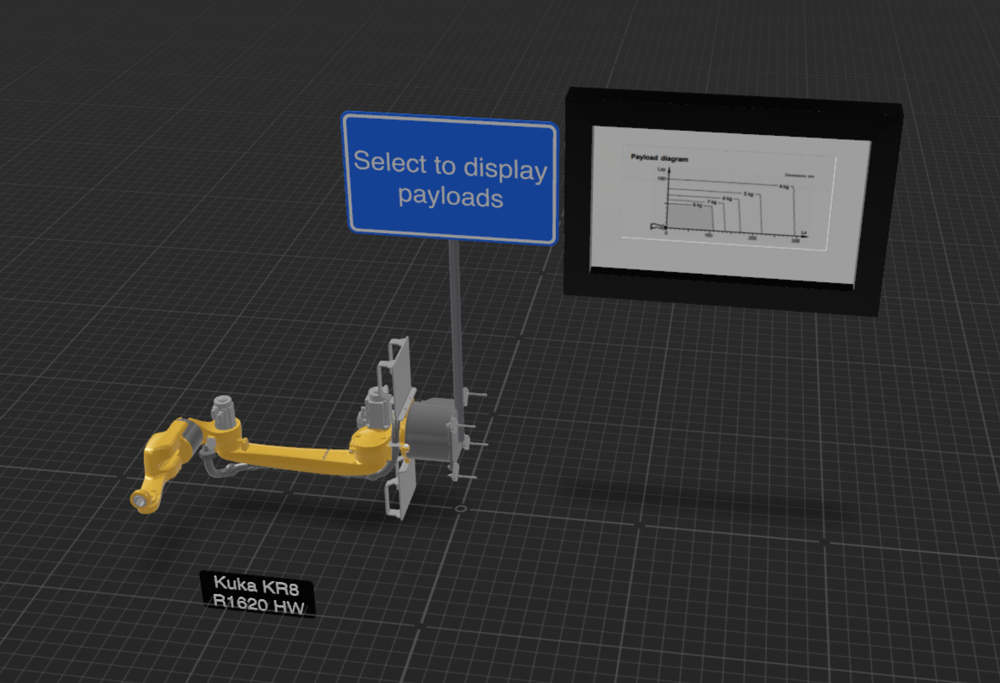

# [Apple ARKit](https://developer.apple.com/augmented-reality/)

## Table of Contents
* [Translating glTF to usdz](#translating-gltf-to-usdz)
* [Author Instructions for Augmented Reality](#authoring-the-instructions)
* [Play Instructions](#playing-the-instructions)

## Translating glTF to usdz

Before you can open the model in Reality Composer, the glTF files must be translated to usdz file format.

To do so, one must install a Python library [USDPython](https://developer.apple.com/download/more/?=USDPython)

Once installed, open a terminal and navigate to the `usdpython_0` directory. Run the command `USD.command`.

In the USD terminal, run `usdzconvert <your input file>.gltf <your output file>.usdz -metersPerUnit 0.001`.

The `meterPerUnit` parameter fixes the dimensions in the converter tool. 0,001 should work well in most cases.

You will get a new `usdz` file that you can now use to import into your new Reality Composer scene.

## Authoring the instructions

Launch Reality Composer, choose `Horizontal Anchor`, unselect `Create with default content`.

Click on the `+ Object` button and import the `usdz` file you created in previous step. You can now author your work instructions and animations into the scene.

If you need further help, please visit this [site](https://developer.apple.com/videos/play/wwdc2019/609/).

## Playing the instructions

Launch reality composer, open your project, and export current scene to new reality file (file extension `.reality`). 

