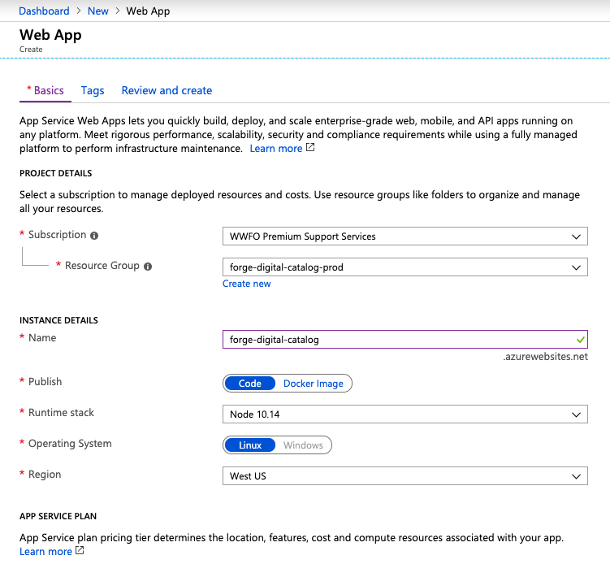
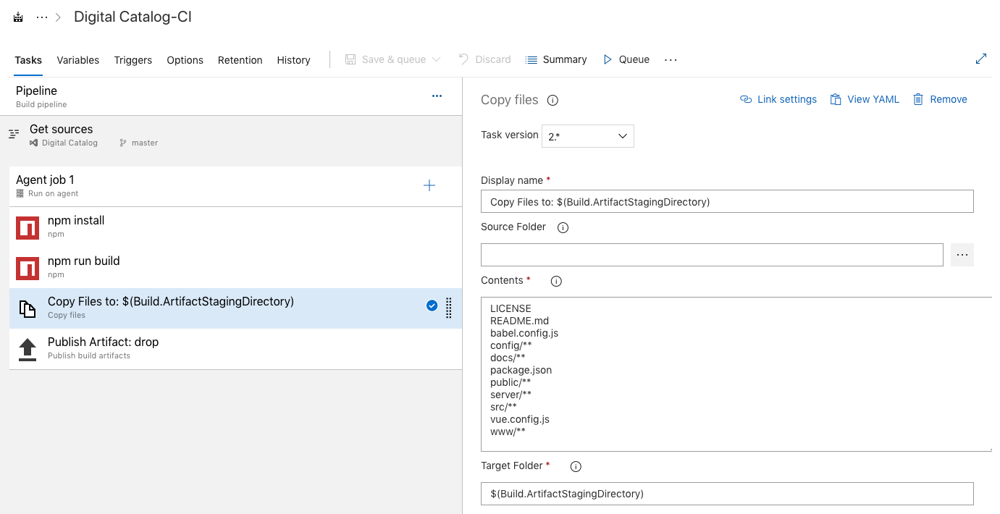
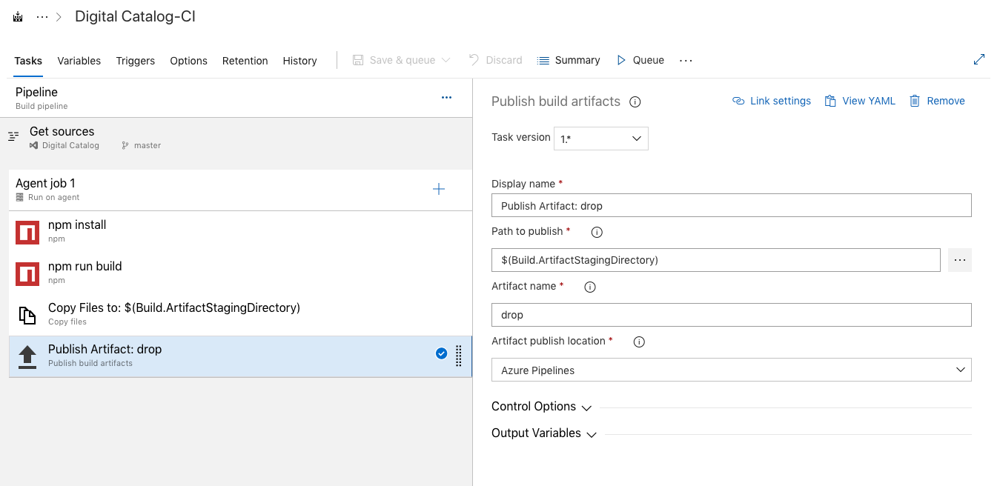
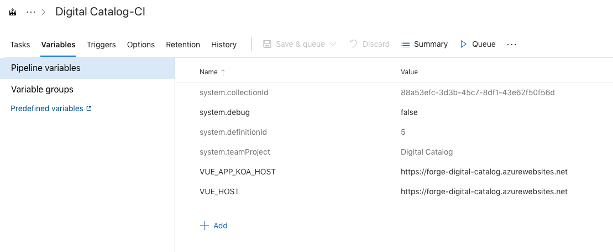
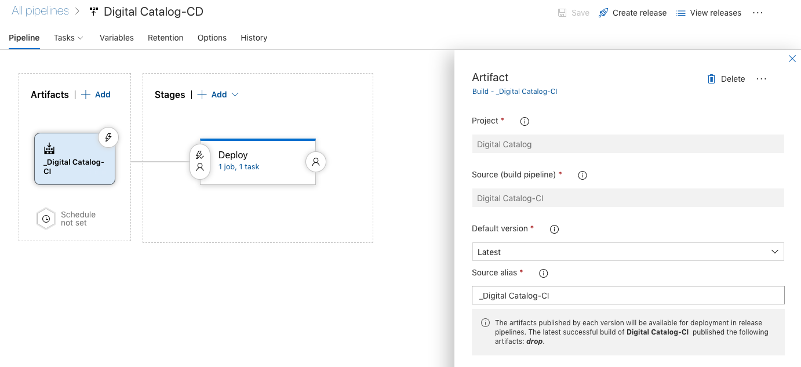
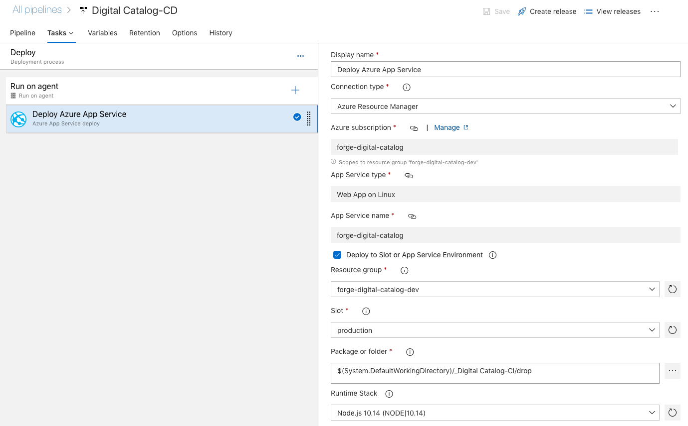

# Azure Deployment

With Microsoft Azure App Service, we can build deploy and scale web apps on a fully managed platform. 

## Table of Contents
* [Prerequisites](#prerequisites)
* [Creating an Azure Web App](#creating-an-azure-web-app)
* [Setting the environment](#setting-the-environment)
* [Deploying code](#deploying-code)
* [Troubleshooting Azure Web App](#troubleshooting-azure-web-app)
* [Additional Resources](#additional-resources)

## Prerequisites

If you're not already a Microsoft Azure customer, you need to sign up.

Please follow this link to create your free Azure account today: https://azure.microsoft.com/en-in/free/

## Creating an Azure Web App

1. Login to your Microsoft Azure portal 
2. Click on **+ Create Resource**
3. Click on **Web App**
4. Input the values as shown in screen capture below

5. As deployment completes, click on **Go to resource**
6. Make sure the app is running by navigating to http://forge-digital-catalog.azurewebsites.net/

## Setting the Environment

We now need to set the environment variables in the new Web App instance. 

From your dashboard, select the new Web App and under Settings click on Configuration. A new page opens and you can set the environment variables by using the Application settings. For each environment variable, click on + New application setting

    DEPLOY_TARGET=azure
    FORGE_CALLBACK_URL=http://forge-digital-catalog.azurewebsites.net/api/forge/callback/oauth
    FORGE_CLIENT_ID=<your app ID>
    FORGE_CLIENT_SECRET=<your app secret>
    MONGODB_URI=<your MongoDB connection uri>
    USE_LOAD_BALANCER=false
    VUE_APP_KOA_HOST=http://forge-digital-catalog.azurewebsites.net/
    VUE_HOST=http://forge-digital-catalog.azurewebsites.net/

Once you have all the environment variables configured, hit save.

## Deploying Code

To deploy the application code to Azure App Service, we will use Azure DevOps build & release pipeline.

### Setting up the Build Pipeline

The build pipeline is composed of four tasks that runs under the Ubuntu default agent:

1. npm install
2. npm run build
3. Copy Files to: $(Build.ArtifactStagingDirectory)

4. Publish Artifact: drop

5. Set pipeline variables: `VUE_APP_KOA_HOST` and `VUE_HOST`

The last step ensures that when the build pipeline runs the static files are generated against the correct server.

### Setting up the Release Pipeline

The release pipeline is responsible for deploying the build artifact to the new Web App Service.

The artifact must be set to the project's source build pipeline and should be configured to run against latest version.

The release pipeline task is to deploy the artifact to the web app service. We can use the `Deploy to Slot or App Environment` feature to deploy the code to the web app service created in previous steps. 

## Troubleshooting Azure Web App

To test if the deployment was successful, open a web browser and navigate to https://forge-digital-catalog.azurewebsites.net/ 

## Additional Resources

[Azure Pipelines Documentation](https://docs.microsoft.com/en-us/azure/devops/pipelines/?view=azure-devops)